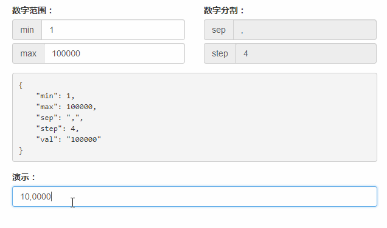

# vue-custom-input

> 基于 Vue2.0 的输入框定制化

- number-input
    - 1000 -> 1,000
    - 0~1000, -1 -> 0; 10001 -> 1000
- phone-input
    - 18288888888 -> 182-8888-8888

## 目录

- [组件](#组件)
- [Demo Build Setup](#demo-build-setup)
- [在线演示](#在线演示)

## 组件

- [number-input](./src/component/number-input/)
- phone-input

## Demo Build Setup

``` bash
# install dependencies
npm install

# serve with hot reload at localhost:8080
npm run dev

# build for production with minification
npm run build

# build for production and view the bundle analyzer report
npm run build --report
```

For detailed explanation on how things work, checkout the [guide](http://vuejs-templates.github.io/webpack/) and [docs for vue-loader](http://vuejs.github.io/vue-loader).

## 在线演示

- [number-input](http://htmlpreview.github.io/?https://github.com/RoamIn/vue-custom-input/blob/master/view/number-input-demo.html)
    - 目前仅支持自然数
    

- phone-input
